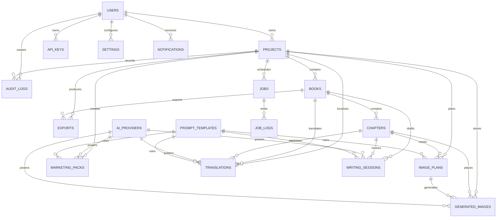

# Database Design

## Purpose

This document defines the planned database architecture for AI Ebook Studio using Neon PostgreSQL.

It is a design document only. It does not create SQL migrations, Alembic revisions, seed data, or application code. Future implementation stages should translate this design into reviewed migrations.

## Database Platform

Primary database:
- Neon PostgreSQL

Local development:
- Docker PostgreSQL may be used to mirror production behavior.

Migration tool:
- Alembic

Recommended PostgreSQL capabilities:
- UUID primary keys
- JSONB for provider payloads and flexible settings
- Full-text search where needed
- Partial indexes for active records
- Time-based indexes for logs, jobs, and history
- Neon branching for preview and staging environments

## Design Principles

- Use normalized relational tables for durable business entities.
- Use JSONB only for flexible provider metadata, user preferences, and event payloads.
- Keep AI provider, prompt, image, export, and job records traceable.
- Never store provider secrets directly in plain text.
- Every user-owned entity must support authorization queries.
- Long-running workflow state should be stored separately from final content.
- Logs and audit data should be append-only.
- Prefer UUID primary keys to avoid leaking record volume and to support distributed creation.

## ER Diagram

## Entity Categories

### Identity And Access

- Users
- API Keys
- Settings

### Project Content

- Projects
- Books
- Chapters
- Writing Sessions

### AI And Prompting

- AI Providers
- Prompt Templates

### Images

- Image Plans
- Generated Images

### Publishing Outputs

- Exports
- Marketing Packs
- Translations

### Operations

- Jobs
- Job Logs
- Audit Logs
- Notifications

## Table Designs

### users

Why it exists:
Stores account identity and ownership roots for all user-created content.

Recommended columns:

| Column | Type | Notes |
|---|---|---|
| id | uuid | Primary key |
| email | citext | Unique, case-insensitive |
| display_name | varchar(160) | Public account display name |
| password_hash | text | Nullable if OAuth-only |
| auth_provider | varchar(50) | `email`, `google`, future providers |
| role | varchar(40) | `user`, `admin` |
| status | varchar(40) | `active`, `disabled`, `pending` |
| email_verified_at | timestamptz | Nullable |
| last_login_at | timestamptz | Nullable |
| created_at | timestamptz | Required |
| updated_at | timestamptz | Required |
| deleted_at | timestamptz | Nullable soft delete |

Primary key:
- `id`

Foreign keys:
- None

Recommended indexes:
- Unique index on `email`
- Index on `status`
- Index on `created_at`

Relationships:
- One user owns many projects.
- One user owns many API keys.
- One user has many settings records.
- One user receives many notifications.

### projects

Why it exists:
Represents the main workspace for an ebook production effort. A project groups books, images, exports, translations, marketing assets, jobs, and audit events.

Recommended columns:

| Column | Type | Notes |
|---|---|---|
| id | uuid | Primary key |
| owner_user_id | uuid | FK to users |
| name | varchar(220) | Internal project name |
| title | varchar(300) | Public-facing book title |
| subtitle | varchar(300) | Nullable |
| genre | varchar(120) | Nullable |
| target_audience | text | Nullable |
| primary_language | varchar(20) | BCP 47 code, e.g. `en`, `en-US` |
| publishing_goal | varchar(120) | KDP, lead magnet, course, etc. |
| status | varchar(50) | `draft`, `editing`, `validating`, `exported`, `archived` |
| metadata | jsonb | Flexible project-level attributes |
| created_at | timestamptz | Required |
| updated_at | timestamptz | Required |
| archived_at | timestamptz | Nullable |
| deleted_at | timestamptz | Nullable |

Primary key:
- `id`

Foreign keys:
- `owner_user_id` references `users.id`

Recommended indexes:
- Index on `owner_user_id`
- Index on `(owner_user_id, status)`
- Index on `updated_at`
- Partial index on `(owner_user_id, updated_at)` where `deleted_at is null`

Relationships:
- One project contains many books.
- One project contains many image plans, generated images, exports, marketing packs, translations, jobs, and audit logs.

### books

Why it exists:
Represents a book artifact inside a project. This allows future support for multiple editions, formats, variants, or volumes under one project.

Recommended columns:

| Column | Type | Notes |
|---|---|---|
| id | uuid | Primary key |
| project_id | uuid | FK to projects |
| title | varchar(300) | Book title |
| subtitle | varchar(300) | Nullable |
| author_name | varchar(220) | Display author |
| description | text | Nullable |
| language | varchar(20) | BCP 47 code |
| book_type | varchar(80) | nonfiction, fiction, workbook, guide |
| status | varchar(50) | `outline`, `draft`, `editing`, `ready`, `archived` |
| word_count | integer | Cached count |
| metadata | jsonb | Trim size, edition, ISBN notes, etc. |
| created_at | timestamptz | Required |
| updated_at | timestamptz | Required |
| deleted_at | timestamptz | Nullable |

Primary key:
- `id`

Foreign keys:
- `project_id` references `projects.id`

Recommended indexes:
- Index on `project_id`
- Index on `(project_id, status)`
- Index on `updated_at`

Relationships:
- One book has many chapters.
- One book has many writing sessions, exports, and translations.

### chapters

Why it exists:
Stores top-level chapter metadata in the normalized manuscript hierarchy. Chapter prose is not stored as one raw text field; the canonical manuscript lives in `parts`, `chapters`, `sections`, `paragraphs`, and `sentences`.

Recommended columns:

| Column | Type | Notes |
|---|---|---|
| id | uuid | Primary key |
| book_id | uuid | FK to books |
| project_id | uuid | Denormalized FK for faster authorization and project queries |
| parent_chapter_id | uuid | Nullable FK to chapters for legacy nesting compatibility or future advanced structures |
| title | varchar(300) | Chapter title |
| slug | varchar(320) | URL-safe identifier within a book |
| position | integer | Sort order |
| summary | text | Nullable |
| status | varchar(50) | `planned`, `draft`, `review`, `approved` |
| word_count | integer | Cached count |
| metadata | jsonb | Flexible formatting or review metadata |
| created_at | timestamptz | Required |
| updated_at | timestamptz | Required |
| deleted_at | timestamptz | Nullable |

Primary key:
- `id`

Foreign keys:
- `book_id` references `books.id`
- `project_id` references `projects.id`
- `parent_chapter_id` references `chapters.id`

Recommended indexes:
- Index on `book_id`
- Index on `(book_id, position)`
- Unique index on `(book_id, slug)` where `deleted_at is null`
- Index on `(project_id, status)`
- Future full-text search index on derived chapter text materialized from sentence nodes

Relationships:
- One chapter can have many sections.
- One chapter can have many writing sessions.
- One chapter can have many image plans.
- One chapter can have many generated image placements.
- One chapter can have many translations.

### parts

Why it exists:
Provides an optional grouping level above chapters so large books can be organized as `Book -> Part -> Chapter`.

Recommended columns:

| Column | Type | Notes |
|---|---|---|
| id | uuid | Primary key |
| project_id | uuid | FK to projects |
| book_id | uuid | FK to books |
| title | varchar(300) | Part title |
| slug | varchar(320) | URL-safe identifier within a book |
| position | integer | Sort order |
| summary | text | Nullable planning summary |
| status | varchar(50) | `planned`, `draft`, `review`, `approved` |
| word_count | integer | Cached aggregate count |
| metadata | jsonb | Optional future structure metadata |
| created_at | timestamptz | Required |
| updated_at | timestamptz | Required |
| deleted_at | timestamptz | Nullable |

Primary key:
- `id`

Foreign keys:
- `project_id` references `projects.id`
- `book_id` references `books.id`

Recommended indexes:
- Index on `book_id`
- Index on `(book_id, position)`
- Unique index on `(book_id, slug)` where `deleted_at is null`

Relationships:
- One part can have many chapters.

### sections

Why it exists:
Represents chapter subsections so text, images, validation, and export can target a meaningful structural unit instead of reparsing raw prose.

Recommended columns:

| Column | Type | Notes |
|---|---|---|
| id | uuid | Primary key |
| project_id | uuid | FK to projects |
| book_id | uuid | FK to books |
| chapter_id | uuid | FK to chapters |
| title | varchar(300) | Nullable section heading |
| position | integer | Sort order within the chapter |
| status | varchar(50) | `planned`, `draft`, `review`, `approved` |
| word_count | integer | Cached aggregate count |
| metadata | jsonb | Optional layout, placement, or editorial metadata |
| created_at | timestamptz | Required |
| updated_at | timestamptz | Required |
| deleted_at | timestamptz | Nullable |

Primary key:
- `id`

Foreign keys:
- `project_id` references `projects.id`
- `book_id` references `books.id`
- `chapter_id` references `chapters.id`

Recommended indexes:
- Index on `chapter_id`
- Index on `(chapter_id, position)`
- Index on `(book_id, status)`

Relationships:
- One section can have many paragraphs.
- One section can have many image placements and validations in future modules.

### paragraphs

Why it exists:
Stores paragraph-level structure so editing, image anchoring, and translation can operate on smaller units than a full section or chapter.

Recommended columns:

| Column | Type | Notes |
|---|---|---|
| id | uuid | Primary key |
| project_id | uuid | FK to projects |
| book_id | uuid | FK to books |
| chapter_id | uuid | FK to chapters |
| section_id | uuid | FK to sections |
| kind | varchar(50) | `body`, `quote`, `list`, `callout`, future rich-text semantics |
| position | integer | Sort order within the section |
| status | varchar(50) | `draft`, `review`, `approved` |
| word_count | integer | Cached aggregate count |
| metadata | jsonb | Optional formatting or editorial metadata |
| created_at | timestamptz | Required |
| updated_at | timestamptz | Required |
| deleted_at | timestamptz | Nullable |

Primary key:
- `id`

Foreign keys:
- `project_id` references `projects.id`
- `book_id` references `books.id`
- `chapter_id` references `chapters.id`
- `section_id` references `sections.id`

Recommended indexes:
- Index on `section_id`
- Index on `(section_id, position)`
- Index on `(chapter_id, position)`

Relationships:
- One paragraph can have many sentences.

### sentences

Why it exists:
Stores the smallest canonical prose unit. Sentence-level persistence enables selective rewrites, fine-grained translation, validation feedback, and deterministic export without reparsing full chapters.

Recommended columns:

| Column | Type | Notes |
|---|---|---|
| id | uuid | Primary key |
| project_id | uuid | FK to projects |
| book_id | uuid | FK to books |
| chapter_id | uuid | FK to chapters |
| section_id | uuid | FK to sections |
| paragraph_id | uuid | FK to paragraphs |
| text | text | Canonical sentence text |
| kind | varchar(50) | `body`, `dialogue`, `caption`, future sentence semantics |
| position | integer | Sort order within the paragraph |
| status | varchar(50) | `draft`, `review`, `approved` |
| metadata | jsonb | Optional annotations, lint markers, or future embeddings references |
| created_at | timestamptz | Required |
| updated_at | timestamptz | Required |
| deleted_at | timestamptz | Nullable |

Primary key:
- `id`

Foreign keys:
- `project_id` references `projects.id`
- `book_id` references `books.id`
- `chapter_id` references `chapters.id`
- `section_id` references `sections.id`
- `paragraph_id` references `paragraphs.id`

Recommended indexes:
- Index on `paragraph_id`
- Index on `(paragraph_id, position)`
- Index on `(chapter_id, position)`
- Future full-text search index on `text`

Relationships:
- Sentences belong to exactly one paragraph and flow upward into section, chapter, part, and book aggregates.

### writing_sessions

Why it exists:
Tracks drafting, rewriting, editing, and AI-assisted writing events without overwriting the canonical structured manuscript hierarchy.

Recommended columns:

| Column | Type | Notes |
|---|---|---|
| id | uuid | Primary key |
| project_id | uuid | FK to projects |
| book_id | uuid | FK to books |
| chapter_id | uuid | Nullable FK to chapters |
| user_id | uuid | FK to users |
| ai_provider_id | uuid | Nullable FK to ai_providers |
| prompt_template_id | uuid | Nullable FK to prompt_templates |
| session_type | varchar(80) | `outline`, `draft`, `rewrite`, `edit`, `critique` |
| input_text | text | Nullable |
| output_text | text | Nullable |
| instruction | text | User instruction |
| model_name | varchar(160) | Provider model used |
| token_input_count | integer | Nullable |
| token_output_count | integer | Nullable |
| cost_estimate | numeric(12, 6) | Nullable |
| status | varchar(50) | `queued`, `running`, `completed`, `failed` |
| metadata | jsonb | Provider response metadata |
| created_at | timestamptz | Required |
| completed_at | timestamptz | Nullable |

Primary key:
- `id`

Foreign keys:
- `project_id` references `projects.id`
- `book_id` references `books.id`
- `chapter_id` references `chapters.id`
- `user_id` references `users.id`
- `ai_provider_id` references `ai_providers.id`
- `prompt_template_id` references `prompt_templates.id`

Recommended indexes:
- Index on `(project_id, created_at)`
- Index on `(book_id, created_at)`
- Index on `(chapter_id, created_at)`
- Index on `(user_id, created_at)`
- Index on `(ai_provider_id, created_at)`
- Index on `status`

Relationships:
- Many writing sessions may target one chapter.
- Many writing sessions may use one prompt template and one AI provider.

### image_plans

Why it exists:
Stores planned visual requirements before image generation. Separating plans from generated images makes the workflow auditable and repeatable.

Recommended columns:

| Column | Type | Notes |
|---|---|---|
| id | uuid | Primary key |
| project_id | uuid | FK to projects |
| book_id | uuid | Nullable FK to books |
| chapter_id | uuid | Nullable FK to chapters |
| prompt_template_id | uuid | Nullable FK to prompt_templates |
| title | varchar(220) | Plan name |
| image_type | varchar(80) | `cover`, `chapter`, `illustration`, `diagram`, `marketing` |
| description | text | Creative brief |
| style_direction | text | Nullable |
| aspect_ratio | varchar(40) | e.g. `1:1`, `16:9`, `2:3` |
| placement_notes | text | Nullable |
| status | varchar(50) | `planned`, `approved`, `generated`, `discarded` |
| metadata | jsonb | Flexible creative attributes |
| created_at | timestamptz | Required |
| updated_at | timestamptz | Required |

Primary key:
- `id`

Foreign keys:
- `project_id` references `projects.id`
- `book_id` references `books.id`
- `chapter_id` references `chapters.id`
- `prompt_template_id` references `prompt_templates.id`

Recommended indexes:
- Index on `project_id`
- Index on `(project_id, image_type)`
- Index on `(chapter_id, status)`
- Index on `status`

Relationships:
- One image plan can produce many generated images.

### generated_images

Why it exists:
Stores metadata for generated visual assets and links each image to its source plan, provider, project, and optional placement target.

Recommended columns:

| Column | Type | Notes |
|---|---|---|
| id | uuid | Primary key |
| project_id | uuid | FK to projects |
| image_plan_id | uuid | Nullable FK to image_plans |
| chapter_id | uuid | Nullable FK to chapters |
| ai_provider_id | uuid | Nullable FK to ai_providers if image providers share provider registry |
| provider_name | varchar(80) | Pollinations, future providers |
| prompt | text | Final image prompt |
| negative_prompt | text | Nullable |
| asset_url | text | Storage URL |
| thumbnail_url | text | Nullable |
| width | integer | Pixels |
| height | integer | Pixels |
| seed | varchar(120) | Nullable |
| status | varchar(50) | `generated`, `approved`, `rejected`, `archived` |
| usage_context | varchar(80) | cover, chapter, marketing, etc. |
| metadata | jsonb | Provider payload and generation parameters |
| created_at | timestamptz | Required |
| updated_at | timestamptz | Required |

Primary key:
- `id`

Foreign keys:
- `project_id` references `projects.id`
- `image_plan_id` references `image_plans.id`
- `chapter_id` references `chapters.id`
- `ai_provider_id` references `ai_providers.id`

Recommended indexes:
- Index on `project_id`
- Index on `(project_id, status)`
- Index on `image_plan_id`
- Index on `(provider_name, created_at)`
- Index on `created_at`

Relationships:
- Many generated images can come from one image plan.
- Generated images can be associated with chapters, covers, or marketing assets.

### exports

Why it exists:
Tracks generated publishing artifacts and their settings, status, validation state, and downloadable locations.

Recommended columns:

| Column | Type | Notes |
|---|---|---|
| id | uuid | Primary key |
| project_id | uuid | FK to projects |
| book_id | uuid | FK to books |
| user_id | uuid | FK to users |
| job_id | uuid | Nullable FK to jobs |
| format | varchar(20) | `docx`, `pdf`, `epub` |
| status | varchar(50) | `queued`, `running`, `completed`, `failed` |
| file_url | text | Nullable until completed |
| file_size_bytes | bigint | Nullable |
| validation_status | varchar(50) | `not_checked`, `passed`, `warning`, `failed` |
| settings | jsonb | Export-specific settings |
| error_message | text | Nullable |
| created_at | timestamptz | Required |
| completed_at | timestamptz | Nullable |

Primary key:
- `id`

Foreign keys:
- `project_id` references `projects.id`
- `book_id` references `books.id`
- `user_id` references `users.id`
- `job_id` references `jobs.id`

Recommended indexes:
- Index on `(project_id, created_at)`
- Index on `(book_id, format, created_at)`
- Index on `(user_id, created_at)`
- Index on `status`

Relationships:
- One book can have many exports.
- One export may be produced by one background job.

### marketing_packs

Why it exists:
Stores generated marketing assets such as book descriptions, blurbs, keywords, social posts, and launch copy.

Recommended columns:

| Column | Type | Notes |
|---|---|---|
| id | uuid | Primary key |
| project_id | uuid | FK to projects |
| book_id | uuid | Nullable FK to books |
| user_id | uuid | FK to users |
| ai_provider_id | uuid | Nullable FK to ai_providers |
| prompt_template_id | uuid | Nullable FK to prompt_templates |
| pack_type | varchar(80) | `kdp_listing`, `launch`, `social`, `email`, `sales_page` |
| title | varchar(220) | Pack label |
| content | jsonb | Structured marketing outputs |
| language | varchar(20) | BCP 47 code |
| status | varchar(50) | `draft`, `approved`, `archived` |
| metadata | jsonb | Provider and generation metadata |
| created_at | timestamptz | Required |
| updated_at | timestamptz | Required |

Primary key:
- `id`

Foreign keys:
- `project_id` references `projects.id`
- `book_id` references `books.id`
- `user_id` references `users.id`
- `ai_provider_id` references `ai_providers.id`
- `prompt_template_id` references `prompt_templates.id`

Recommended indexes:
- Index on `(project_id, pack_type)`
- Index on `(book_id, language)`
- Index on `(user_id, created_at)`

Relationships:
- One project can have many marketing packs.
- Marketing packs can be generated using prompt templates and AI providers.

### translations

Why it exists:
Stores localized versions of book, chapter, metadata, and marketing content.

Recommended columns:

| Column | Type | Notes |
|---|---|---|
| id | uuid | Primary key |
| project_id | uuid | FK to projects |
| book_id | uuid | Nullable FK to books |
| chapter_id | uuid | Nullable FK to chapters |
| user_id | uuid | FK to users |
| ai_provider_id | uuid | Nullable FK to ai_providers |
| prompt_template_id | uuid | Nullable FK to prompt_templates |
| source_language | varchar(20) | BCP 47 code |
| target_language | varchar(20) | BCP 47 code |
| source_text | text | Nullable for metadata-only translations |
| translated_text | text | Nullable while queued |
| translation_scope | varchar(80) | `book`, `chapter`, `metadata`, `marketing` |
| status | varchar(50) | `queued`, `translated`, `reviewed`, `approved`, `failed` |
| glossary | jsonb | Optional term map |
| metadata | jsonb | Provider details and review notes |
| created_at | timestamptz | Required |
| updated_at | timestamptz | Required |

Primary key:
- `id`

Foreign keys:
- `project_id` references `projects.id`
- `book_id` references `books.id`
- `chapter_id` references `chapters.id`
- `user_id` references `users.id`
- `ai_provider_id` references `ai_providers.id`
- `prompt_template_id` references `prompt_templates.id`

Recommended indexes:
- Index on `(project_id, target_language)`
- Index on `(book_id, target_language)`
- Index on `(chapter_id, target_language)`
- Index on `status`

Relationships:
- One chapter can have many translations into different target languages.
- One translation can use one AI provider and one prompt template.

### ai_providers

Why it exists:
Stores provider registry metadata for text AI and image providers. This supports provider abstraction, routing, health checks, and future provider expansion.

Recommended columns:

| Column | Type | Notes |
|---|---|---|
| id | uuid | Primary key |
| provider_key | varchar(80) | Unique identifier: `openai`, `anthropic`, `gemini`, `openrouter`, `pollinations` |
| provider_type | varchar(40) | `text`, `image`, `multimodal` |
| display_name | varchar(120) | Human-readable provider name |
| base_url | text | Nullable |
| status | varchar(50) | `active`, `disabled`, `degraded` |
| supports_streaming | boolean | Default false |
| supports_images | boolean | Default false |
| supports_structured_output | boolean | Default false |
| default_model | varchar(160) | Nullable |
| configuration | jsonb | Non-secret provider config |
| created_at | timestamptz | Required |
| updated_at | timestamptz | Required |

Primary key:
- `id`

Foreign keys:
- None

Recommended indexes:
- Unique index on `provider_key`
- Index on `(provider_type, status)`

Relationships:
- One provider can power many writing sessions, generated images, translations, and marketing packs.

### prompt_templates

Why it exists:
Stores reusable prompts by domain, version, scope, and status. This enables controlled prompt evolution and traceability.

Recommended columns:

| Column | Type | Notes |
|---|---|---|
| id | uuid | Primary key |
| owner_user_id | uuid | Nullable FK to users for user-owned templates |
| name | varchar(220) | Template name |
| slug | varchar(240) | Stable identifier |
| category | varchar(80) | writing, editing, images, marketing, translation, validator, system |
| version | integer | Starts at 1 |
| system_prompt | text | Nullable |
| user_template | text | Main prompt template |
| input_schema | jsonb | Expected inputs |
| output_schema | jsonb | Expected outputs |
| is_system | boolean | True for platform templates |
| status | varchar(50) | `draft`, `active`, `archived` |
| metadata | jsonb | Notes, tags, provider hints |
| created_at | timestamptz | Required |
| updated_at | timestamptz | Required |

Primary key:
- `id`

Foreign keys:
- `owner_user_id` references `users.id`

Recommended indexes:
- Unique index on `(slug, version)`
- Index on `(category, status)`
- Index on `owner_user_id`
- GIN index on `metadata` if tag search becomes important

Relationships:
- Prompt templates can be used by writing sessions, image plans, translations, and marketing packs.

### settings

Why it exists:
Stores user-level and future workspace-level preferences without forcing schema changes for every setting.

Recommended columns:

| Column | Type | Notes |
|---|---|---|
| id | uuid | Primary key |
| user_id | uuid | FK to users |
| scope | varchar(80) | `profile`, `provider`, `writing`, `export`, `notifications`, `security` |
| key | varchar(120) | Setting key |
| value | jsonb | Setting value |
| created_at | timestamptz | Required |
| updated_at | timestamptz | Required |

Primary key:
- `id`

Foreign keys:
- `user_id` references `users.id`

Recommended indexes:
- Unique index on `(user_id, scope, key)`
- Index on `user_id`
- GIN index on `value` only if querying inside settings becomes necessary

Relationships:
- One user can have many settings.

### jobs

Why it exists:
Tracks asynchronous work such as exports, image generation, full-book validation, translations, and batch writing tasks.

Recommended columns:

| Column | Type | Notes |
|---|---|---|
| id | uuid | Primary key |
| project_id | uuid | Nullable FK to projects |
| user_id | uuid | FK to users |
| job_type | varchar(100) | `export`, `image_generation`, `translation`, `validation`, etc. |
| status | varchar(50) | `queued`, `running`, `completed`, `failed`, `cancelled` |
| priority | integer | Default 0 |
| input_payload | jsonb | Job input |
| result_payload | jsonb | Nullable job output |
| error_message | text | Nullable |
| attempts | integer | Default 0 |
| scheduled_at | timestamptz | Nullable |
| started_at | timestamptz | Nullable |
| completed_at | timestamptz | Nullable |
| created_at | timestamptz | Required |
| updated_at | timestamptz | Required |

Primary key:
- `id`

Foreign keys:
- `project_id` references `projects.id`
- `user_id` references `users.id`

Recommended indexes:
- Index on `(status, priority, created_at)`
- Index on `(user_id, created_at)`
- Index on `(project_id, created_at)`
- Index on `job_type`

Relationships:
- One job can have many job logs.
- One job may produce exports, images, translations, or validation outputs.

### job_logs

Why it exists:
Stores append-only logs for background jobs to support observability, debugging, and user-facing progress.

Recommended columns:

| Column | Type | Notes |
|---|---|---|
| id | uuid | Primary key |
| job_id | uuid | FK to jobs |
| level | varchar(20) | `debug`, `info`, `warning`, `error` |
| message | text | Log message |
| context | jsonb | Structured log fields |
| created_at | timestamptz | Required |

Primary key:
- `id`

Foreign keys:
- `job_id` references `jobs.id`

Recommended indexes:
- Index on `(job_id, created_at)`
- Index on `(level, created_at)`
- Consider time-based retention or partitioning for high volume.

Relationships:
- Many job logs belong to one job.

### audit_logs

Why it exists:
Stores append-only security and business audit events for accountability, support, and compliance.

Recommended columns:

| Column | Type | Notes |
|---|---|---|
| id | uuid | Primary key |
| user_id | uuid | Nullable FK to users |
| project_id | uuid | Nullable FK to projects |
| action | varchar(120) | e.g. `project.created`, `export.downloaded` |
| entity_type | varchar(80) | Affected entity type |
| entity_id | uuid | Affected entity id |
| ip_address | inet | Nullable |
| user_agent | text | Nullable |
| metadata | jsonb | Event details |
| created_at | timestamptz | Required |

Primary key:
- `id`

Foreign keys:
- `user_id` references `users.id`
- `project_id` references `projects.id`

Recommended indexes:
- Index on `(user_id, created_at)`
- Index on `(project_id, created_at)`
- Index on `(entity_type, entity_id)`
- Index on `(action, created_at)`
- Consider monthly partitioning as volume grows.

Relationships:
- Audit logs may reference users, projects, and any entity by type/id.

### notifications

Why it exists:
Stores user-facing notices for job completion, validation results, export readiness, provider errors, and account events.

Recommended columns:

| Column | Type | Notes |
|---|---|---|
| id | uuid | Primary key |
| user_id | uuid | FK to users |
| project_id | uuid | Nullable FK to projects |
| type | varchar(80) | `job_completed`, `validation_failed`, `export_ready`, etc. |
| title | varchar(220) | Notification title |
| body | text | Notification body |
| action_url | text | Nullable |
| read_at | timestamptz | Nullable |
| metadata | jsonb | Extra context |
| created_at | timestamptz | Required |

Primary key:
- `id`

Foreign keys:
- `user_id` references `users.id`
- `project_id` references `projects.id`

Recommended indexes:
- Index on `(user_id, created_at)`
- Partial index on `(user_id, created_at)` where `read_at is null`
- Index on `(project_id, created_at)`

Relationships:
- One user receives many notifications.
- Notifications may be related to a project.

### api_keys

Why it exists:
Stores user or system API keys for future integrations, automation, and external access. Raw API keys must never be stored.

Recommended columns:

| Column | Type | Notes |
|---|---|---|
| id | uuid | Primary key |
| user_id | uuid | FK to users |
| name | varchar(160) | User-visible key name |
| key_prefix | varchar(20) | Non-secret display prefix |
| key_hash | text | Secure hash of the key |
| scopes | text[] | Allowed scopes |
| status | varchar(50) | `active`, `revoked`, `expired` |
| last_used_at | timestamptz | Nullable |
| expires_at | timestamptz | Nullable |
| created_at | timestamptz | Required |
| revoked_at | timestamptz | Nullable |

Primary key:
- `id`

Foreign keys:
- `user_id` references `users.id`

Recommended indexes:
- Unique index on `key_hash`
- Index on `(user_id, status)`
- Index on `key_prefix`
- Index on `expires_at`

Relationships:
- One user can own many API keys.

## Relationship Summary

| Relationship | Cardinality | Notes |
|---|---:|---|
| users -> projects | 1:N | Personal project ownership |
| projects -> books | 1:N | Supports future editions and volumes |
| books -> chapters | 1:N | Ordered manuscript structure |
| chapters -> writing_sessions | 1:N | Draft and revision history |
| projects -> image_plans | 1:N | Planned creative requirements |
| image_plans -> generated_images | 1:N | Multiple generation attempts per plan |
| books -> exports | 1:N | Repeated exports across formats and versions |
| projects -> marketing_packs | 1:N | Multiple marketing asset groups |
| books/chapters -> translations | 1:N | Multi-language support |
| ai_providers -> AI outputs | 1:N | Provider traceability |
| prompt_templates -> AI outputs | 1:N | Prompt traceability |
| jobs -> job_logs | 1:N | Operational observability |

## Index Strategy

Core patterns:

- Ownership queries: index foreign keys to `users`, `projects`, `books`, and `chapters`.
- Recency queries: index `created_at` or `updated_at` for dashboards and histories.
- Status filtering: compound indexes on owner/project plus status.
- Append-only logs: time-based indexes and future partitioning.
- Soft deletes: partial indexes where `deleted_at is null`.
- Search: future full-text indexes on book titles, derived manuscript text, sentence text, and marketing content.

Recommended global conventions:

- Every foreign key should have an index unless proven unnecessary.
- Every user-facing list should have a matching compound index for its filter and sort order.
- Avoid indexing large JSONB payloads unless a query requires it.
- Use GIN indexes selectively for JSONB tags, metadata search, or full-text content.

## Primary Key Strategy

Use UUID primary keys for all tables.

Rationale:
- Avoid predictable sequential IDs.
- Support distributed record creation.
- Make future imports and multi-region workflows easier.
- Reduce coupling to insertion order.

Recommended default:
- PostgreSQL `gen_random_uuid()` once migrations are implemented.

## Foreign Key Strategy

Use explicit foreign keys for durable relationships:

- Content ownership
- Project grouping
- Book/chapter hierarchy
- Provider and prompt traceability
- Job/log relationships

For polymorphic references in audit logs, use:
- `entity_type`
- `entity_id`

Rationale:
Audit events may refer to many entity types, and strict foreign keys are not practical for every event target.

## Recommended Data Types

| Use Case | Type |
|---|---|
| Primary keys | `uuid` |
| Foreign keys | `uuid` |
| Short labels | `varchar(n)` |
| Long prose | `text` |
| Flexible metadata | `jsonb` |
| Currency/cost estimates | `numeric(12, 6)` |
| Counts | `integer` or `bigint` |
| File sizes | `bigint` |
| Timestamps | `timestamptz` |
| Email | `citext` |
| IP address | `inet` |
| Scope lists | `text[]` |
| Booleans | `boolean` |

## Normalization

The schema should target third normal form for core business data.

Normalized entities:

- Users are separate from projects.
- Projects are separate from books.
- Books are separate from chapters.
- Prompt templates are separate from generation records.
- AI providers are separate from generated outputs.
- Jobs are separate from job logs.

Intentional denormalization:

- `project_id` on chapters and writing sessions supports fast authorization and project-scoped queries.
- Cached `word_count` fields avoid expensive recalculation.
- Provider names may be stored alongside provider IDs in generated image records for historical clarity if provider registry entries change.
- JSONB metadata stores provider-specific payloads that should not shape the core schema.

## Future Scalability

### Neon Branching

Use Neon branches for:

- Preview environments
- Staging validation
- Migration rehearsal
- Safe experimentation

### Partitioning Candidates

Consider partitioning when volume grows:

- `audit_logs` by month
- `job_logs` by month
- `writing_sessions` by project or time if generation history becomes large
- `notifications` by time if retention grows

### Archival Strategy

Long-term archived data candidates:

- Old job logs
- Old notifications
- Failed generation attempts
- Historical provider payloads
- Superseded exports

### Search Strategy

Future search may require:

- PostgreSQL full-text search for chapters and projects
- GIN indexes for tags and JSONB metadata
- External search service only if PostgreSQL search becomes insufficient

### Multi-Tenant Evolution

The initial design supports personal ownership through `users`.

Future team workspaces should add:

- `organizations`
- `organization_memberships`
- `workspace_roles`
- `project_collaborators`

At that stage, authorization should move from simple `owner_user_id` checks to workspace-scoped role checks.

## Data Retention

Recommended retention approach:

- Keep user projects until deletion or account closure.
- Keep audit logs for a defined compliance window.
- Keep job logs for a shorter operational window unless tied to support cases.
- Let users delete generated assets where legally and operationally safe.
- Preserve export records for traceability, but allow artifact deletion if storage cost requires it.

## Security Considerations

- Store API keys only as secure hashes.
- Store provider secrets outside the database in environment variables or a secret manager.
- Enforce row-level authorization in application services.
- Avoid storing raw payment data.
- Avoid storing sensitive user manuscript data in logs.
- Treat generated content and prompts as private user data.

## Implementation Notes For Future Migrations

- Enable required extensions deliberately during migration planning, such as `pgcrypto` for UUID generation and `citext` for email.
- Create tables in dependency order: users, providers, templates, projects, books, chapters, then dependent workflow tables.
- Add indexes after tables and foreign keys.
- Add constraints for status fields either with database enums or check constraints.
- Prefer check constraints for early flexibility; move to enums only once values stabilize.
- Review every cascade rule carefully. Default to restricted deletes and soft deletion for user content.
