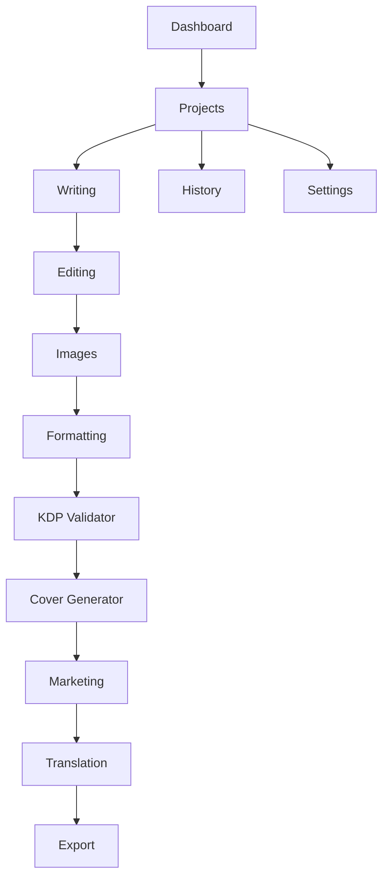
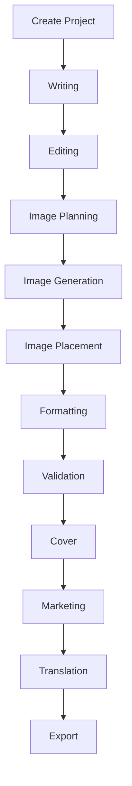

# AI Ebook Studio Product Blueprint

## Document Purpose

This blueprint defines the product direction, operating model, core modules, publishing workflow, requirements, and long-term expansion strategy for AI Ebook Studio.

This is a planning document only. It does not implement application features or prescribe final UI screens. Future stages should use this document as the product and architecture reference before implementation begins.

## 1. Product Vision

### Mission

AI Ebook Studio exists to help authors, creators, educators, agencies, and small publishers produce high-quality ebooks with an organized, AI-assisted workflow from first idea to publishable export.

The product should reduce the operational complexity of ebook production while keeping the user in creative control. AI should support planning, writing, editing, visual direction, validation, formatting, translation, and marketing, but the user remains the author, reviewer, and final decision-maker.

### Target Users

- Independent authors creating fiction, nonfiction, guides, workbooks, or educational ebooks.
- Content creators turning expertise into digital products.
- Coaches, consultants, and course creators publishing lead magnets or paid ebooks.
- Small publishers managing repeatable production workflows.
- Agencies producing ebooks for clients.
- Educators and training teams creating structured learning material.
- Future teams collaborating across writing, design, editing, and marketing roles.

### Problems Solved

- Ebook creation is fragmented across writing tools, image tools, formatting software, validation checklists, and export utilities.
- Authors often struggle with structure, consistency, editing quality, cover direction, and marketplace readiness.
- AI output can be inconsistent without reusable prompts, project context, and workflow constraints.
- Publishing platforms such as KDP require formatting, metadata, cover, and quality checks that are easy to miss.
- Translation, marketing copy, and derivative assets are usually handled after the book is complete, creating delays and rework.

AI Ebook Studio solves these problems by providing one guided workspace for planning, producing, validating, and exporting ebook projects.

### Long-Term Roadmap

Long-term product direction:

- Become a full ebook production operating system.
- Support multiple AI providers for resilience, cost control, and user preference.
- Support multiple image providers through a separate image provider layer.
- Offer reusable book templates, prompt packs, publishing checklists, and workflows.
- Expand into collaboration, marketplace assets, and cloud storage integrations.

## 2. Core Modules

### Module Map

### Dashboard

Purpose:
Provide a command center for the user’s ebook work, recent projects, production status, tasks, and system notifications.

Expected capabilities:
- Recent projects
- Project statuses
- Progress indicators
- Pending validation issues
- Draft/export summaries
- Usage and provider status summaries

### Projects

Purpose:
Represent each ebook as a structured workspace containing manuscript, images, formatting rules, validation results, export history, and marketing assets.

Expected capabilities:
- Create and manage ebook projects
- Store metadata such as title, subtitle, author, genre, language, audience, trim size, and publishing goals
- Track project lifecycle
- Organize chapters, assets, prompts, and outputs

### Writing

Purpose:
Help users plan and draft manuscript content using project context and reusable prompt workflows.

Expected capabilities:
- Book idea expansion
- Outline generation
- Chapter planning
- Draft generation
- Rewrite support
- Tone and audience alignment

### Editing

Purpose:
Improve manuscript quality through structured review, revision, clarity checks, consistency checks, and style guidance.

Expected capabilities:
- Grammar and clarity review
- Chapter-level editing
- Tone consistency
- Structural critique
- Readability feedback
- Human approval workflow

### Images

Purpose:
Plan, generate, manage, and place visual assets such as cover concepts, chapter images, diagrams, and illustrations.

Expected capabilities:
- Image brief creation
- Prompt generation
- Provider-based generation
- Asset library
- Image metadata tracking
- Placement planning

### Formatting

Purpose:
Transform manuscript and assets into a consistent ebook layout ready for validation and export.

Expected capabilities:
- Chapter structure rules
- Heading hierarchy
- Front matter and back matter planning
- Image placement rules
- Style presets
- Format-specific checks

### KDP Validator

Purpose:
Help users prepare ebooks for Amazon Kindle Direct Publishing requirements and common quality expectations.

Expected capabilities:
- Metadata checklist
- Manuscript completeness checks
- Formatting checks
- Cover readiness checks
- Image quality checklist
- Export readiness report

### Cover Generator

Purpose:
Support cover concept creation, visual direction, image generation, and cover package preparation.

Expected capabilities:
- Cover brief
- Genre-aware cover direction
- Image prompt generation
- Typography notes
- Front cover planning
- Future full-wrap cover support

### Translation

Purpose:
Translate ebook projects into additional languages while preserving meaning, tone, structure, and formatting intent.

Expected capabilities:
- Language selection
- Chapter translation
- Glossary and term control
- Tone preservation
- Translation review checklist
- Localized metadata and marketing copy

### Marketing

Purpose:
Generate and organize launch assets for the ebook.

Expected capabilities:
- Book description
- Short blurb
- Subtitle ideas
- Keywords
- Category suggestions
- Social posts
- Email copy
- Sales page copy

### Export

Purpose:
Produce downloadable publishing artifacts from approved project content.

Expected capabilities:
- DOCX export
- PDF export
- EPUB export
- Export history
- Export settings
- Validation-before-export gating

### Settings

Purpose:
Manage user, workspace, billing, provider, brand, security, and application preferences.

Expected capabilities:
- Profile settings
- Provider preferences
- Default writing style
- Brand voice
- Export defaults
- Security settings
- Future billing and team settings

### History

Purpose:
Track meaningful changes, generations, edits, exports, validations, and decisions across the project lifecycle.

Expected capabilities:
- Generation history
- Revision history
- Export history
- Validation history
- Provider usage events
- Future rollback and comparison

## 3. User Types

### Guest

Guest users are unauthenticated visitors.

Expected access:
- Public landing pages
- Pricing pages
- Documentation or help previews
- Optional limited demo in future stages

Restrictions:
- Cannot save projects
- Cannot export
- Cannot use paid provider-backed workflows

### Registered User

Registered users are authenticated customers with personal workspaces.

Expected access:
- Dashboard
- Project creation and management
- Writing, editing, image, validation, export, marketing, and translation workflows according to plan limits
- Personal settings
- Usage history

### Administrator

Administrators operate and support the SaaS platform.

Expected access:
- User management
- System configuration
- Provider health visibility
- Usage and billing diagnostics
- Abuse monitoring
- Support tooling

### Future Team Workspace

Future team workspaces support organizations with multiple users and roles.

Expected roles:
- Owner
- Admin
- Editor
- Designer
- Reviewer
- Viewer

Expected capabilities:
- Shared projects
- Role-based access control
- Comments and approvals
- Team style guides
- Shared prompt libraries
- Organization billing

## 4. Complete Publishing Workflow

### Workflow Description

1. Create Project
   The user defines title, genre, audience, language, format goals, marketplace goals, and project context.

2. Writing
   The user creates outlines, chapters, and drafts using project-aware AI assistance.

3. Editing
   The manuscript is reviewed for clarity, grammar, structure, consistency, tone, and audience fit.

4. Image Planning
   The user identifies required images, cover concepts, style direction, and placement needs.

5. Image Generation
   The image provider layer generates visual assets using approved image prompts.

6. Image Placement
   Images are assigned to chapters, cover areas, or marketing assets.

7. Formatting
   The manuscript and assets are prepared according to ebook structure and export rules.

8. Validation
   The project is checked against marketplace, quality, and formatting requirements.

9. Cover
   Cover concepts and final cover assets are prepared.

10. Marketing
   Sales copy, descriptions, keywords, categories, and launch content are created.

11. Translation
   Approved content may be translated and localized for additional markets.

12. Export
   Final artifacts are generated, stored, and made available for download.

## 5. Functional Requirements

### Dashboard Requirements

Purpose:
Give users a high-level view of their publishing pipeline.

Inputs:
- User account
- Project data
- Project statuses
- Validation results
- Export history

Outputs:
- Project overview
- Action reminders
- Status summaries
- Recent activity

Dependencies:
- Projects module
- History module
- Settings module

### Projects Requirements

Purpose:
Create and manage the central ebook workspace.

Inputs:
- Title
- Subtitle
- Author name
- Genre
- Audience
- Language
- Publishing target
- Project brief

Outputs:
- Project record
- Project metadata
- Project structure
- Workflow state

Dependencies:
- Database
- User account
- Settings

### Writing Requirements

Purpose:
Create structured manuscript drafts.

Inputs:
- Project brief
- Outline
- Chapter goals
- Tone
- Audience
- Prompt templates

Outputs:
- Draft chapters
- Outlines
- Writing notes
- Alternative drafts

Dependencies:
- Projects module
- Prompt system
- Text AI provider abstraction
- History module

### Editing Requirements

Purpose:
Improve manuscript quality before formatting and export.

Inputs:
- Draft text
- Style preferences
- Editing mode
- Target audience
- User feedback

Outputs:
- Revised text
- Editorial notes
- Readability feedback
- Issue lists

Dependencies:
- Writing module
- Text AI provider abstraction
- History module

### Images Requirements

Purpose:
Manage image planning, generation, and asset organization.

Inputs:
- Image brief
- Style direction
- Aspect ratio
- Prompt template
- Placement target

Outputs:
- Image prompts
- Generated image assets
- Image metadata
- Placement recommendations

Dependencies:
- Projects module
- Image provider abstraction
- Asset storage
- History module

### Formatting Requirements

Purpose:
Prepare the manuscript for validation and export.

Inputs:
- Manuscript content
- Image placements
- Format preset
- Front matter
- Back matter
- Style settings

Outputs:
- Structured book document
- Formatting warnings
- Export-ready content package

Dependencies:
- Writing module
- Editing module
- Images module
- Export module

### KDP Validator Requirements

Purpose:
Assess readiness for KDP-style publishing constraints.

Inputs:
- Project metadata
- Manuscript structure
- Cover data
- Image data
- Export settings

Outputs:
- Validation report
- Severity-ranked issues
- Fix recommendations
- Readiness score

Dependencies:
- Projects module
- Formatting module
- Cover Generator
- Export module

### Cover Generator Requirements

Purpose:
Create cover direction and cover assets.

Inputs:
- Title
- Subtitle
- Author name
- Genre
- Audience
- Mood
- Visual references
- Marketplace constraints

Outputs:
- Cover concepts
- Image prompts
- Generated cover art
- Cover readiness notes

Dependencies:
- Projects module
- Image provider abstraction
- KDP Validator
- Marketing module

### Translation Requirements

Purpose:
Localize completed or approved content.

Inputs:
- Source text
- Source language
- Target language
- Glossary
- Tone guide
- Formatting constraints

Outputs:
- Translated manuscript
- Localized metadata
- Translation notes
- Review checklist

Dependencies:
- Writing module
- Editing module
- Text AI provider abstraction
- Projects module

### Marketing Requirements

Purpose:
Prepare sales and launch assets.

Inputs:
- Book summary
- Audience
- Genre
- Differentiators
- Keywords
- Tone

Outputs:
- Book description
- Short blurb
- Keywords
- Category ideas
- Social copy
- Email copy
- Sales page copy

Dependencies:
- Projects module
- Writing module
- Text AI provider abstraction
- Translation module for localized assets

### Export Requirements

Purpose:
Generate final publishing files.

Inputs:
- Approved manuscript
- Formatting settings
- Image placements
- Cover assets
- Export format
- Validation status

Outputs:
- DOCX file
- PDF file
- EPUB file
- Export logs
- Export history entry

Dependencies:
- Formatting module
- KDP Validator
- Asset storage
- Background jobs

### Settings Requirements

Purpose:
Manage user and workspace preferences.

Inputs:
- Profile details
- Security preferences
- Provider preferences
- Brand voice
- Export defaults
- Notification settings

Outputs:
- Saved preferences
- Provider configuration
- Default project settings

Dependencies:
- User account
- Authentication system
- Provider registry

### History Requirements

Purpose:
Preserve important project events and support future versioning.

Inputs:
- Project events
- AI generation events
- Edit events
- Export events
- Validation events

Outputs:
- Timeline
- Audit trail
- Usage records
- Future rollback points

Dependencies:
- All project modules
- Database
- Provider usage tracking

## 6. Non-Functional Requirements

### Performance

- Dashboard and project pages should load quickly for active users.
- Long-running jobs such as exports, image generation, and full-book validation should run asynchronously.
- AI and image requests should use timeouts, retries, and user-visible status.
- Large manuscripts should be processed in sections where appropriate.

### Scalability

- The architecture must support thousands of users.
- Provider calls must be isolated behind queueable services where workflows are long-running.
- Database design must support project growth, asset history, and usage tracking.
- The system should support horizontal scaling for stateless backend services.

### Security

- Provider keys must never be exposed to the frontend.
- Authentication and authorization must protect all user-owned resources.
- Role-based access control is required before team workspaces launch.
- Sensitive operations should be auditable.
- User content should be treated as private by default.

### Maintainability

- Each module should have clear boundaries.
- Provider-specific code must remain isolated in provider adapters.
- Shared contracts should be versioned and reviewed.
- Documentation should be updated when product behavior changes.
- Tests should scale with risk and module complexity.

### Accessibility

- The UI should meet WCAG 2.1 AA goals.
- Keyboard navigation should be supported for core workflows.
- Forms must have accessible labels and validation states.
- Color contrast must work in light and dark modes.
- Long writing and editing sessions should use readable typography and calm interface states.

## 7. Future Expansion Ideas

### Marketplace

A marketplace could offer templates, prompt packs, cover styles, formatting presets, checklists, and publishing workflows.

### Templates

Templates could accelerate common ebook types:

- Nonfiction guide
- Workbook
- Children’s book
- Lead magnet
- Course companion
- Recipe book
- Business report

### Plugin System

A plugin system could allow controlled extensions for:

- New AI providers
- New export formats
- New validation rules
- Marketplace integrations
- Storage providers

### Collaboration

Collaboration features could include:

- Comments
- Assignments
- Approvals
- Team roles
- Shared style guides
- Live or async editing workflows

### Cloud Storage

Cloud storage integrations could support:

- Google Drive
- Dropbox
- OneDrive
- S3-compatible storage
- Cloudflare R2

### Version History

Version history could provide:

- Draft snapshots
- AI generation comparisons
- Restore points
- Export version comparison
- Change attribution

## 8. Success Metrics

### Activation Metrics

- Percentage of registered users who create a first project.
- Percentage of projects that complete initial setup.
- Time from signup to first useful draft.

### Engagement Metrics

- Weekly active users.
- Projects edited per user.
- Chapters generated or revised.
- Validation reports run.
- Image briefs created.

### Completion Metrics

- Percentage of projects reaching export.
- Average time from project creation to first export.
- Number of successful exports per user.
- Percentage of projects passing validation before export.

### Quality Metrics

- User satisfaction with generated drafts.
- User acceptance rate for editing suggestions.
- Validation issue reduction over time.
- Export error rate.

### Business Metrics

- Free-to-paid conversion.
- Monthly recurring revenue.
- Churn rate.
- Average revenue per account.
- Provider cost per successful export.

### Operational Metrics

- API response time.
- Background job completion time.
- Provider failure rate.
- Retry rate.
- Support tickets per active customer.

## Product Decision Principles

- Build workflow depth before adding surface area.
- Keep AI provider choice flexible.
- Keep image generation separate from text generation.
- Prefer user control over fully automatic publishing.
- Validate before export.
- Make every generated artifact traceable to inputs, settings, and provider metadata.
